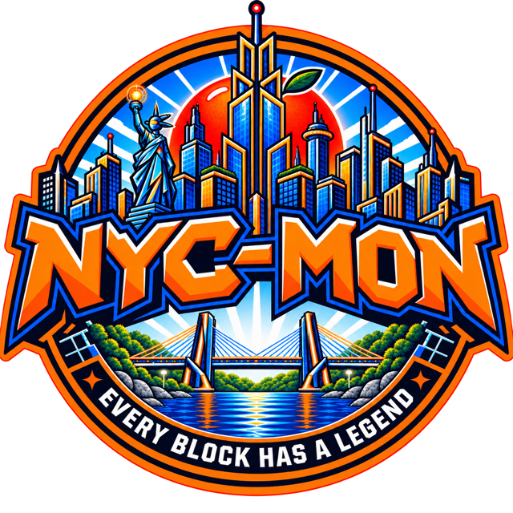

<p align="center">
  
</p>

<h3 align="center">Every block has a legend.</h3>

<p align="center">
  
  
  
  
  
  
  <a href="LICENSE"></a>
</p>

NYC-MON is a near-future New York where intelligent Mons live alongside people. Phase 1 builds the H-Lynk companion loop on iOS and Android (meet three starters, pick an egg, hatch it, care for the Baby Mon in real time) plus the product site on Next.js.

## Monorepo

| Path | Package | What it is |
|---|---|---|
| `apps/mobile` | `mobile` | Expo Router app for iOS and Android. Also carries the Meta Horizon and PICO build variants. |
| `apps/web` | `web` | Next.js product site. Holds no database or auth secrets. |
| `apps/admin-vite` | `admin-vite` | TanStack Start on Vite. Payload admin at `/admin`, Payload REST and Better Auth at `/payload-api` ([ADR 0003](docs/adr/0003-admin-app-split.md)). |
| `apps/storybook` | `storybook` | Storybook 10 on Vite with react-native-web. Stories live next to their components in `packages/ui`. |
| `packages/ui` | `@acme/ui` | NYC-Tron, the UI kit: universal semantic components, neon controls, Skia and three.js/WebGPU backgrounds. See [its README](packages/ui/README.md). |
| `packages/theme` | `@acme/theme` | Design tokens. `tokens.ts` is the only file with hex values, and `build-css.mjs` turns it into the Tailwind 4 and Uniwind CSS. |
| `packages/core` | `@acme/core` | Game types, Zod schemas, the care simulation and save format. |
| `packages/content` | `@acme/content` | Starter Mons and egg data. |
| `packages/payload` | `@acme/payload` | Payload CMS config, collections and a typed REST reader. |
| `packages/auth` | `@acme/auth` | The auth client apps import: Better Auth with passkeys, returning typed results instead of throwing. |
| `packages/assets` | `@acme/assets` | Brand marks, fonts, district photos. |
| `packages/spatial` | `@acme/spatial` | Viro and Rive XR scenes. Out of Phase 1 scope apart from the site copy it exports. |
| `packages/app` | `@acme/app` | Shared Solito screens and providers. |
| `packages/config` | `@acme/config` | Shared lint, format and TypeScript presets plus the import-boundary rules. |

[docs/REPO_MAP.md](docs/REPO_MAP.md) has every route, entry point and pinned version.

## Getting started

You need Node `>=24.15.0 <26` and pnpm 12 (the root `package.json` pins `pnpm@12.8.1`).

```sh
pnpm install
cp .env.example .env
```

`.env.example` lists every variable with no values. Only `apps/admin-vite` reads the database and auth secrets (`DATABASE_URL`, `PAYLOAD_SECRET`, `BETTER_AUTH_*`). The web site and Storybook run without them. Keep real values in `.env.local`, which git ignores.

```sh
pnpm dev                            # every app through Turborepo
pnpm --filter mobile ios            # or: android, android:quest, android:pico
pnpm --filter web dev               # product site
pnpm --filter admin-vite dev        # Payload admin on http://localhost:5174/admin
pnpm --filter storybook dev         # NYC-Tron on http://localhost:6006

pnpm test                           # Vitest in core, content, Storybook; node:test in mobile
pnpm typecheck
pnpm lint
```

`postinstall` copies the Viro WASM sidecars and CanvasKit into the apps' public folders. The build expects those pinned local copies, so keep the scripts pointed at them instead of a CDN.

New code starts from the generators: `pnpm gen domain <name>`, `pnpm gen feature <name>`, `pnpm gen component <Name>`.

## How it renders

- **Product UI.** Tailwind 4 everywhere: Uniwind on native, `react-native-css` on web.
- **The Mon.** A live three.js creature on the WebGPU renderer with TSL materials, landing in Milestone 2.
- **HUD and meters.** React Native Skia, which also draws the Grid Floor and Glyph City. Web runs the same code through CanvasKit.
- **Animated surfaces.** Rive: Nitro on native, WebGL2 on web.
- **XR (later phases).** Shared Viro scenes on a forked OpenXR path for Meta Horizon and PICO. [docs/SPATIAL.md](docs/SPATIAL.md) and [docs/XR-PLATFORM-MATRIX.md](docs/XR-PLATFORM-MATRIX.md) cover the details.

## Conventions

- Each dependency version lives once, in the `catalog:` block of `pnpm-workspace.yaml`.
- Screens and routes stay thin. Reusable UI goes in `packages/ui`, with a story, before a screen uses it.
- Raw DOM and native styling stay behind the `@acme/ui` boundary, and ESLint enforces it.
- Skia handles procedural 2D graphics, not layout. Viro owns XR world geometry.

## Docs

| Doc | What's in it |
|---|---|
| [prompts/LAWS.md](prompts/LAWS.md) | The repo laws every change follows. |
| [docs/REPO_MAP.md](docs/REPO_MAP.md) | Real paths, routes and versions. |
| [docs/DESIGN_SYSTEM.md](docs/DESIGN_SYSTEM.md) | The proposed daylit token set and how NYC-Tron applies it. |
| [docs/design/](docs/design/) | Screen designs, research, H-Lynk direction, contrast checks. |
| [docs/adr/](docs/adr/) | Architecture decision records. |
| [docs/canon/](docs/canon/) | The creator's canon. Decisions recorded here outrank everything else in the repo. The Bible files are in [docs/canon/source/](docs/canon/source/). |

## Status

Milestone 0 (canon and foundations) is done. Milestone 1 (mobile and web shells and the first seven mobile screens) is in design. Device verification is still pending. [docs/DEVICE_CHECKS.md](docs/DEVICE_CHECKS.md) tracks what has run on hardware.

## Credits

NYC-Tron is inspired by [NeonBlade UI](https://neonbladeui.neuronrush.com) by [vprix21](https://github.com/vprix21/neonblade-ui), released under MIT. All 41 NeonBlade components have an NYC-Tron counterpart, rebuilt for React Native and web and redrawn around New York: circuit traces became subway lines, and the Grid Floor became the street grid behind most screens. NYC-Tron does not depend on the NeonBlade package. Thanks to vprix21 for building it and releasing it openly.

[packages/ui/THIRD-PARTY-NOTICES.md](packages/ui/THIRD-PARTY-NOTICES.md) lists each port and carries NeonBlade's licence.

## Licence

[MIT](LICENSE).
