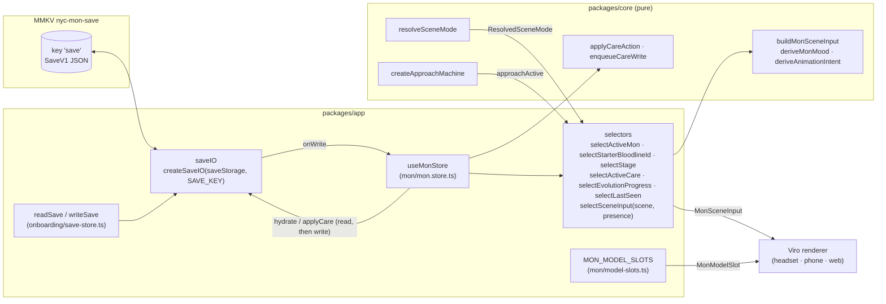

# Spatial contract

What a renderer on Quest 3, phone or web reads to draw the Mon, where that data comes from, and how the scene mode is picked. Decisions and their reasons are in ADR 0010 (scene contract and store), ADR 0011 (mode resolution) and ADR 0012 (approach trigger).

## Store ownership

- The save key is the only persisted copy of the Mon. The store keeps the parsed save in memory and writes the whole save back through `saveIO`.
- `applyCare` re-reads the save before applying, so writes from other features are not lost.
- Other writers (`storeCallerProfile` today, the hatch writer later) call `writeSave`, which goes through `saveIO`; its write listener updates the store, so no manual re-hydrate is needed.
- Core never imports Viro, React, MMKV or `@acme/content`.

## Mode resolution matrix

`resolveSceneMode({ platform, capabilities, anchors, preference })`. Capabilities use the Viro fork's `ViroOpenXRRuntimeCapabilities` field names. A scene model exists when `sceneUnderstandingAvailable` or `planeDetectionAvailable` is true; otherwise anchors are ignored.

| # | Platform | Capabilities | Usable anchors | Preference | Mode | Tabletop on | H-Lynk |
|---|---|---|---|---|---|---|---|
| 1 | phone | any | any | any | `screen` | — | `app` |
| 2 | web | any | any | any | `preview` | — | `app` |
| 3 | headset | `null` | any | any | `screen` | — | `app` |
| 4 | headset | set | any | `screen` | `screen` | — | `app` |
| 5 | headset | set | floor + wall | `room` | `room` | — | wrist / hand |
| 6 | headset | set | table, missing floor or wall | `room` | `tabletop` | table | wrist / hand |
| 7 | headset | set, LOCAL_FLOOR or floor anchor | no table, missing floor or wall | `room` | `tabletop` | floor | wrist / hand |
| 8 | headset | set | table | `tabletop` | `tabletop` | table | wrist / hand |
| 9 | headset | set, LOCAL_FLOOR or floor anchor | no table | `tabletop` | `tabletop` | floor | wrist / hand |
| 10 | headset | set, no LOCAL_FLOOR | no table, no floor | `room` or `tabletop` | `screen` | — | `app` |

Wrist / hand: `wrist_panel` when `handTrackingAvailable`, else `hand_panel`. `street` is never produced in Phase 1.

## Scene input fields

`MonSceneInput` (`packages/core/schemas/spatial.ts`), built only by `buildMonSceneInput`.

| Field | Type | Source | Phase 1 |
|---|---|---|---|
| `mon.monInstanceId` | string | `MonInstance` | set |
| `mon.speciesId` | string | `MonInstance` | set |
| `mon.bloodlineId` | `F\d{2}` | `@acme/content` lookup by `speciesId` | set |
| `mon.stage` | `'Egg' \| 'Baby' \| 'Small' \| 'Mid' \| 'Max'` | `MonInstance` | `Baby` after hatch (Law 7) |
| `mon.care` | `{ energy, fullness, social }`, each in [0, 1] | `CareState` as persisted | set |
| `mon.mood` | `'content' \| 'asleep' \| 'sluggish' \| 'needs-fullness' \| 'needs-energy' \| 'needs-social'` | `deriveMonMood(care)` | set |
| `mon.intent` | `'idle' \| 'approach' \| 'attention' \| 'eat' \| 'sleep' \| 'play' \| 'refuse' \| 'hatch' \| 'evolve'` | `deriveAnimationIntent(care, presence)` | `evolve` unreachable while `evolutionEnabled` is false |
| `mode` | `'screen' \| 'tabletop' \| 'room' \| 'street' \| 'preview'` | `resolveSceneMode` | never `street` (unreachable by type) |
| `placement` | `'table' \| 'floor' \| null` | `resolveSceneMode` | `null` in `screen` and `preview`; `floor` in `room` |
| `anchors` | `{ space: 'local-floor', table?, floor?, wall? }`, each a `Pose` | anchors `resolveSceneMode` accepted | absent in flat modes and when dropped as stale |
| `hLynk` | `'app' \| 'hand_panel' \| 'wrist_panel'` | `resolveSceneMode` | set |
| `legend` | `null` | — | always `null`; Phase 2: `{ legendId, blockId } \| null` |

`Pose` is `{ position: { x, y, z }, orientation: { x, y, z, w } }`: metres, unit quaternion, LOCAL_FLOOR space (+Y up, floor at y = 0).

## Approach trigger defaults

`DEFAULT_APPROACH_CONFIG` (tabletop 0.6 m enter / 0.8 m exit, room 1.5 m / 2.0 m, 30° cone, 750 ms dwell, 20 s cooldown, 12 per session) is a set of design choices, not canon. Canon gives no approach distances, angles or timings. Reasons and tests are in [ADR 0012](../adr/0012-approach-trigger.md).

## Model slots

`MonModelSlot = { bloodlineId, stage, glbUri: string | null, clips: { idle, approach, attention, eat, sleep, play, refuse, hatch, evolve } }`. `MON_MODEL_SLOTS` has one slot per shipped bloodline × stage (3 × 5 = 15), every value `null` until Mike supplies the glb files.

## Phase-2 slots on `MonInstance`

| Field | Type | Phase 1 value | Read by |
|---|---|---|---|
| `originBlock` | `OriginBlockId \| null` (branded string) | `null` | nothing |
| `habitatTags` | `HabitatTag[]` (branded strings) | `[]` | nothing |
| `activeHours` | `{ startMinute, endMinute } \| null`, minutes after local midnight, wraps when end < start | `null` | nothing |

All three are zod-defaulted, so saves written before they existed still load.
